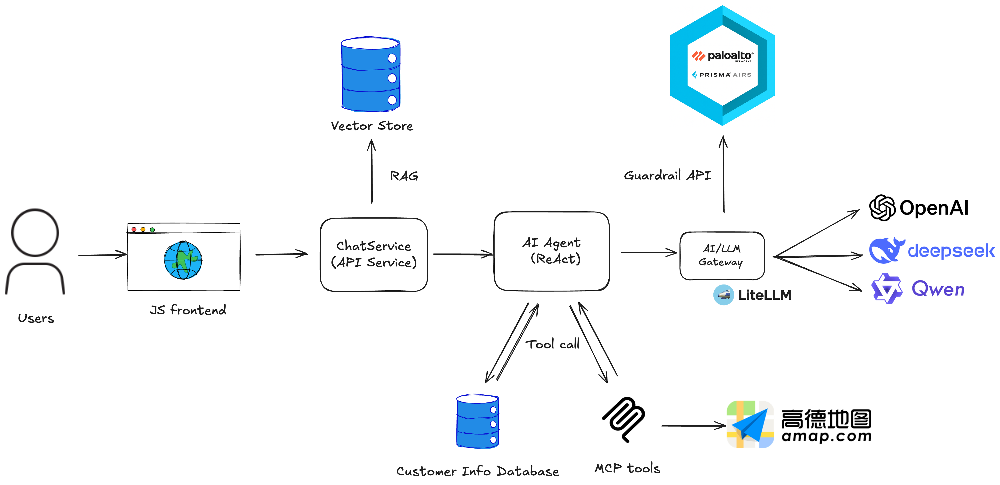

# Vito's Pizza Cafe - AI Customer Service Application

A comprehensive demonstration of a pizza cafe customer service application built with LangGraph and RAG (Retrieval-Augmented Generation). This project showcases various AI security vulnerabilities and their mitigation using Palo Alto Networks AI Runtime Security (AIRS) API.

## Overview

This application demonstrates common attack vectors in Gen AI applications, particularly in RAG-based systems, and how to protect against them using Palo Alto Networks AI Runtime Security API. It serves as a practical example of implementing AI security best practices in a real-world scenario.


## Prerequisites

- Python 3.12 or higher
- pip package manager
- **uv** (recommended): Fast Python package manager and tool runner
  ```bash
  curl -LsSf https://astral.sh/uv/install.sh | sh
  ```
  Note: `uvx` (included with uv) is required if you want to use AMAP-STDIO MCP transport
- Docker and Docker Compose (optional, only needed for LiteLLM proxy)
- API Keys:
  - **OpenAI API Key**: Required for text embedding in RAG system and LLM responses
  - **Additional LLM Provider Options** (if not using OpenAI for LLM):
    - DeepSeek API Key
    - OpenRouter API Key
    - AWS Bedrock credentials
    - Or use LiteLLM proxy for unified access to multiple providers
  - **Palo Alto Networks AIRS API Key**: Required for AI security features
- Palo Alto Networks AI Runtime Security (AIRS) API Profiles for both input and output inspection

## Application Architecture

### System Overview
    


### Message Processing Flow

1. User submits a query through the Chatbot Web UI
2. The Chatbot Web UI securely forwards the query to the application
3. Relevant documents are retrieved from the vector store based on the query
4. The application sends the query and contextual data to the LLM
5. The LLM queries the external database for customer information
6. A response is generated using both vector store and database information
7. The response is sent to the user

### Core Components

The application consists of the following components:
- RAG system for information retrieval
    - Chunking based on markdown tags
    - FAISS vector store
    - Similarity search based on OpenAI embeddings (text-embedding-3-small)
- LangGraph React agent-based conversation flow
- SQLite Database
- Database integration using LangChain bind tools

## Installation Guide

1. Clone the repository:
```bash
git clone https://github.com/leonhanl/vitos-pizza-cafe
cd vitos-pizza-cafe
```

2. Create and activate a virtual environment:
```bash
python -m venv .venv
# On Windows:
.venv\Scripts\activate
# On Unix or MacOS:
source .venv/bin/activate
```

3. Install dependencies:
```bash
pip install -e .
```

4. Configure environment variables:
```bash
cp .env.example .env
# Edit .env with your API keys and configuration
# See .env.example for all available LLM provider options
```

## Running the Application

1. Start the backend:
   ```bash
   ./start_backend.sh
   ```

   To verify the backend API:
   ```bash
   python tests/test_api_integration.py
   ```

2. Launch the web interface:
   ```bash
   ./start_frontend.sh
   ```

   Open a web browser and navigate to: http://localhost:5500

3. Try some common questions:
   ```
   What's on the menu?
   Do you deliver?
   ```

4. Stop the servers when done:
   ```bash
   ./stop_backend.sh
   ./stop_frontend.sh
   ```

**Note**: The start scripts run servers in the background. Logs are stored in the `logs/` directory with timestamps.

### Frontend Configuration for Different Domains

If your frontend and backend are deployed on different domains (e.g., frontend at `vitos.lianglab.net` and backend at `vitos-api.lianglab.net`), you can configure the backend API URL using the `BACKEND_API_URL` environment variable.

**Option 1: Inline with start_frontend.sh**
```bash
BACKEND_API_URL="https://vitos-api.lianglab.net" ./start_frontend.sh
```

**Option 2: Inline with restart_frontend.sh**
```bash
BACKEND_API_URL="https://vitos-api.lianglab.net" ./restart_frontend.sh
```

**Option 3: Using export for multiple commands**
```bash
export BACKEND_API_URL="https://vitos-api.lianglab.net"
./start_frontend.sh  # or ./restart_frontend.sh
```

**Note**:
- Do not include the `/api/v1` suffix - it will be added automatically
- If `BACKEND_API_URL` is not set, the frontend defaults to `http://localhost:8000`
- The configuration is auto-generated into `frontend/config.js` at startup

## LiteLLM Proxy (Optional)

LiteLLM is a unified API gateway that allows you to use multiple LLM providers through a single interface. It's particularly useful for:

- **Multi-provider support**: Switch between OpenAI, DeepSeek, Qwen, and other models without code changes
- **Built-in guardrails**: Optional AIRS security scanning at the proxy level
- **Cost tracking**: Monitor API usage and costs across different providers
- **Load balancing**: Distribute requests across multiple models or API keys

### Setup

1. Navigate to the litellm directory and start the proxy:
   ```bash
   cd litellm
   docker-compose up -d
   ```

   Open a browser, and visit: http://localhost:4000/ui/

2. Configure your application to use the proxy by updating `.env`:
   ```bash
   OPENAI_BASE_URL="http://localhost:4000"
   OPENAI_API_KEY=your_litellm_master_key_here
   LLM_MODEL=deepseek-chat  # or any model configured in litellm_config.yaml
   ```

3. The proxy will be available at http://localhost:4000


### Supported Models

The LiteLLM proxy comes pre-configured with:
- **OpenAI**: gpt-5, gpt-5-mini, gpt-5-nano
- **DeepSeek**: deepseek-chat, deepseek-reasoner
- **Alibaba Qwen**: qwen-max, qwen-plus

You can add more models by editing `litellm/litellm_config.yaml`.

### AIRS Integration

Some models in the configuration have optional AIRS guardrails enabled. These provide input/output filtering at the proxy level before requests reach your application.

To stop the LiteLLM proxy:
```bash
cd litellm
docker-compose down
```

To tear down the LiteLLM proxy:
```bash
cd litellm
docker-compose down -v
```


## API Usage for Red Teaming

The backend API supports both stateful and stateless modes:

### Stateless Mode (Recommended for Red Teaming)

For batch testing and red teaming scenarios, use stateless mode to prevent memory leaks:

```bash
curl -X POST http://localhost:8000/api/v1/chat \
  -H "Content-Type: application/json" \
  -d '{"message": "What pizzas do you have?", "stateless": true}'
```

**Benefits:**
- No conversation history stored in memory
- No conversation ID management needed
- Ideal for running hundreds/thousands of test cases
- Zero memory footprint per request

### Stateful Mode (Default)

For testing multi-turn conversations:

```bash
curl -X POST http://localhost:8000/api/v1/chat \
  -H "Content-Type: application/json" \
  -d '{"message": "What pizzas do you have?", "conversation_id": "test-123"}'
```

### Python API Client

For programmatic access, use the Python client from `tests/api_client.py`:

```python
from tests.api_client import VitosApiClient

with VitosApiClient(base_url="http://localhost:8000") as client:
    # Stateless mode for red teaming
    response = client.chat("What's on the menu?", stateless=True)
    print(response)

    # Stateful mode with conversation tracking
    response = client.chat("What's your special today?", conversation_id="test-123")
```

See `tests/test_api_integration.py` for comprehensive examples of both modes.

## Contributing

Contributions are welcome through the standard GitHub fork and pull request workflow.

## License

This project is licensed under the MIT License - see the [LICENSE](LICENSE) file for details.

## Support

For support, please open an issue in the GitHub repository or contact the maintainers.


