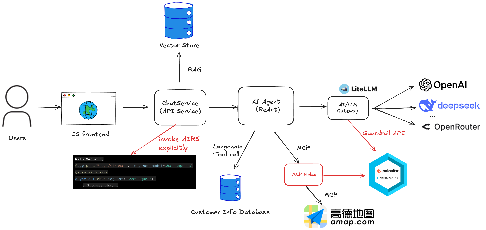

# Vito's Pizza Cafe - AI Customer Service Application

A pizza cafe customer service application demonstrating AI security vulnerabilities and their mitigation using Palo Alto Networks AI Runtime Security (AIRS). Built with LangGraph and RAG (Retrieval-Augmented Generation), this project serves as a practical example of implementing AI security best practices.

## Overview

This application demonstrates common attack vectors in generative AI applications, particularly in RAG-based systems, and shows how to protect against them using Palo Alto Networks AI Runtime Security API.

## Prerequisites

- Python 3.12 or higher
- pip package manager
- **uv** (recommended): Fast Python package manager and tool runner
  ```bash
  curl -LsSf https://astral.sh/uv/install.sh | sh
  ```
- **Node.js and npm** (optional): Required if you want to use AMAP-STDIO MCP transport
  - `npx` command (included with npm) is used to run the AMAP MCP server
- Docker and Docker Compose (needed for the LiteLLM proxy)
- API Keys:
  - **OpenAI API Key**: Required for text embedding in RAG system and LLM responses
  - **Additional LLM Provider Options** (if not using OpenAI for LLM):
    - DeepSeek API Key
    - OpenRouter API Key
    - Or use LiteLLM proxy for unified access to multiple providers
  - **Palo Alto Networks AIRS API Key**: Required for AI security features
- Palo Alto Networks AI Runtime Security (AIRS) API Profiles for both input and output inspection

## Application Architecture

### System Overview
    


### Message Processing Flow

The application uses a **LangGraph React agent pattern** where the LLM autonomously decides which tools to use:

1. User submits a query through the Chatbot Web UI
2. The Chatbot Web UI securely forwards the query to the application
3. Relevant documents are retrieved from the vector store based on the query (always performed)
4. The application creates a React agent with available tools (database, MCP) and sends the query with context
5. The LLM analyzes the query and **conditionally** calls tools as needed:
   - Database tools for customer information queries
   - MCP tools (e.g., AMAP) for location-related queries
6. A response is generated using retrieved context and tool results (if any)
7. The response is sent to the user

**Note:** Steps 5-6 vary per query - not all tools are invoked for every request.

### Core Components

The application consists of the following components:
- RAG system for information retrieval
    - Chunking based on markdown tags
    - FAISS vector store
    - Similarity search based on OpenAI embeddings (`text-embedding-3-small`)
- LangGraph React agent-based conversation flow
- SQLite database
- Database integration using LangChain bind tools
- MCP with LangChain
- LiteLLM integration
- MCP relay

## Installation Guide

1. Clone the repository:
```bash
git clone https://github.com/leonhanl/vitos-pizza-cafe
cd vitos-pizza-cafe
```

2. Create and activate a virtual environment:
```bash
python -m venv .venv
# On Windows:
.venv\Scripts\activate
# On Unix or MacOS:
source .venv/bin/activate
```

3. Install dependencies:
```bash
pip install -e .
```

4. Configure environment variables:
```bash
cp .env.example .env
# Edit .env with your API keys and configuration
# See .env.example for all available LLM provider options
```

## Running the Application

1. Start the backend:
   ```bash
   ./start_backend.sh
   # or
   ./restart_backend.sh
   ```

   To verify the backend API:
   ```bash
   python tests/test_basic_api.py
   ```

   To run the full backend API test suite:
   ```bash
   python tests/test_api_integration.py
   ```

2. Launch the web interface:
   ```bash
   ./start_frontend.sh
   # or
   ./restart_frontend.sh
   ```

   Open a web browser and navigate to: http://localhost:5500

3. Test the application with common questions:
   ```
   What's on the menu?
   Do you deliver?
   ```

4. Stop the servers when done:
   ```bash
   ./stop_backend.sh
   ./stop_frontend.sh
   ```

**Note**: The start scripts run servers in the background. Logs are stored in the `logs/` directory.

### Frontend Configuration for Different Domains

If your frontend and backend are deployed on different domains (e.g., frontend at `vitos.lianglab.net` and backend at `vitos-api.lianglab.net`), you can configure the backend API URL using the `BACKEND_API_URL` environment variable.

**Option 1: Inline with start_frontend.sh**
```bash
BACKEND_API_URL="https://vitos-api.lianglab.net" ./start_frontend.sh
```

**Option 2: Inline with restart_frontend.sh**
```bash
BACKEND_API_URL="https://vitos-api.lianglab.net" ./restart_frontend.sh
```

**Option 3: Using export for multiple commands**
```bash
export BACKEND_API_URL="https://vitos-api.lianglab.net"
./start_frontend.sh  # or ./restart_frontend.sh
```

**Note**:
- Do not include the `/api/v1` suffix - it will be added automatically
- If `BACKEND_API_URL` is not set, the frontend defaults to `http://localhost:8000`
- The configuration is auto-generated into `frontend/config.js` at startup

## LiteLLM Proxy (Optional)

LiteLLM is a unified API gateway for accessing multiple LLM providers through a single interface. It's particularly useful for:

- **Multi-provider support**: Switch between OpenAI, DeepSeek, Qwen, and other models without code changes
- **Built-in guardrails**: Optional AIRS security scanning at the proxy level
- **Cost tracking**: Monitor API usage and costs across different providers
- **Load balancing**: Distribute requests across multiple models or API keys

### Setup

1. Navigate to the litellm directory and start the proxy:
   ```bash
   cd litellm
   docker-compose up -d
   ```

   Open a browser and visit the web UI at: http://localhost:4000/ui/

2. Configure your application to use the proxy by updating `.env`:
   ```bash
   OPENAI_BASE_URL="http://localhost:4000"
   OPENAI_API_KEY=your_litellm_master_key_here
   LLM_MODEL=deepseek-chat  # or any model configured in litellm_config.yaml
   ```

### Supported Models

The LiteLLM proxy comes pre-configured with:

- **OpenAI**: `gpt-5`, `gpt-5-mini`, `gpt-5-nano`
- **DeepSeek**: `deepseek-chat`, `deepseek-reasoner`
- **Alibaba Qwen**: `qwen-max`, `qwen-plus`

You can add more models by editing `litellm/litellm_config.yaml`.

### AIRS Integration

Some models in the configuration have optional AIRS guardrails enabled. These provide input/output filtering at the proxy level before requests reach your application.

To stop the LiteLLM proxy:
```bash
cd litellm
docker-compose down
```

To tear down the LiteLLM proxy:
```bash
cd litellm
docker-compose down -v
```

## MCP Integration (Optional)

The Model Context Protocol (MCP) extends the application with additional capabilities through standardized tool integrations. This project demonstrates two distinct MCP integration approaches.

### Integration Approaches

**Important:** Choose ONE approach - they are mutually exclusive:

| Approach | Configuration | Use Case |
|----------|--------------|----------|
| **Direct Connection** | `.env` only | Simple setup, direct access to MCP servers |
| **Proxy Mode** | `mcp-relay.yaml` | Security scanning with AIRS, centralized gateway |

### Direct MCP Connection (AMAP)

[AMAP (AutoNavi)](https://lbs.amap.com/api/mcp-server/gettingstarted) is a leading location-based services provider in China, offering map and geocoding capabilities through their MCP server integration.

**Use Case**: This MCP tool enables the AI assistant to answer delivery-related questions like "Do you deliver to [location]?" by calculating the distance between the customer's location and Vito's Pizza Cafe. The tool provides geocoding, distance calculation, and route planning capabilities that help determine service availability based on delivery radius.

**Integration**: Connect directly to AMAP services without a security proxy (for proxy-based security scanning, see PAN MCP Relay section below).

**Supported transports:**
- **AMAP-SSE** (Server-Sent Events): HTTP-based streaming
- **AMAP-STDIO** (Standard I/O): Local subprocess via `npx`

**Configuration** in `.env`:
```bash
AMAP_API_KEY=your_amap_api_key_here

# Enable ONE transport type
AMAP_SSE_ENABLED=true   # For SSE transport
AMAP_STDIO_ENABLED=false

# OR
AMAP_SSE_ENABLED=false
AMAP_STDIO_ENABLED=true  # For stdio transport (requires npx)
```

**Important:** When using PAN MCP Relay, disable direct AMAP connections (set both to `false`).

### PAN MCP Relay (Centralized Security Proxy)

[PAN MCP Relay](https://github.com/PaloAltoNetworks/pan-mcp-relay) is a security-enhanced MCP relay server by Palo Alto Networks that acts as a centralized gateway for all MCP tools. It provides real-time AI threat protection by scanning tool interactions for:

- Prompt injections and jailbreak attempts
- Malicious URLs and toxic content
- Sensitive data leakage (PII/PCI)
- AI agentic threats and insecure outputs

**Key Architecture:** The relay sits between your application and all upstream MCP servers, scanning tool descriptions, parameters, and responses through AIRS security profiles.

```
Vito's Backend → PAN MCP Relay (port 8800) → Upstream MCP Servers (AMAP, etc.)
                      ↓ AIRS Security Checks
```

**Setup:**

1. **Configure all MCP servers** in `pan-mcp-relay/mcp-relay.yaml`:
   ```yaml
   mcpRelay:
     apiKey: <AIRS_API_KEY>
     aiProfile: Demo-Profile-for-Input

   mcpServers:
     amap:
       command: npx
       args:
         - -y
         - "@amap/amap-maps-mcp-server"
       env:
         AMAP_MAPS_API_KEY: <API_KEY>
   ```

2. **Start the relay server**:
   ```bash
   cd pan-mcp-relay
   ./start_pan_mcp_relay.sh
   ```

   The relay will listen on http://localhost:8800

3. **Enable in application** in `.env`:
   ```bash
   # Enable PAN MCP Relay
   PAN_MCP_RELAY_ENABLED=true
   PAN_MCP_RELAY_URL=http://127.0.0.1:8800/mcp/

   # Disable direct MCP connections
   AMAP_SSE_ENABLED=false
   AMAP_STDIO_ENABLED=false
   ```

4. **Start your application**:
   ```bash
   ./start_backend.sh
   ```

**Requirements:**
- Valid Palo Alto Networks AIRS API key
- AI Security Profile configured in Strata Cloud Manager
- Node.js and npm installed (`npx` command available)

**Important:** All MCP servers must be defined in `mcp-relay.yaml` - the relay acts as the single point of access for all tool integrations.

To stop the relay:
```bash
# Find and stop the relay process
pkill -f pan-mcp-relay
```

## API Usage for Red Teaming

The backend API supports both stateful and stateless modes:

### Stateless Mode (Recommended for Red Teaming)

For batch testing and red teaming scenarios, use stateless mode to prevent memory leaks:

```bash
curl -X POST http://localhost:8000/api/v1/chat \
  -H "Content-Type: application/json" \
  -d '{"message": "What pizzas do you have?", "stateless": true}'
```

**Benefits of stateless mode:**
- No conversation history stored in memory
- No conversation ID management needed
- Ideal for running hundreds or thousands of test cases
- Zero memory footprint per request

### Stateful Mode (Default)

For testing multi-turn conversations:

```bash
curl -X POST http://localhost:8000/api/v1/chat \
  -H "Content-Type: application/json" \
  -d '{"message": "What pizzas do you have?", "conversation_id": "test-123"}'
```

### Python API Client

For programmatic access, use the Python client from `tests/api_client.py`:

```python
from tests.api_client import VitosApiClient

with VitosApiClient(base_url="http://localhost:8000") as client:
    # Stateless mode for red teaming
    response = client.chat("What's on the menu?", stateless=True)
    print(response)

    # Stateful mode with conversation tracking
    response = client.chat("What's your special today?", conversation_id="test-123")
```

See `tests/test_api_integration.py` for comprehensive examples of both modes.

## AI Runtime Security (AIRS) - Streaming Protection

The application implements **progressive streaming AIRS protection** to detect and block malicious content in real-time during AI response generation. This provides immediate protection against prompt injections, PII disclosure, and other security threats without waiting for the complete response.

### Architecture

**Two-Layer Security Scanning:**

1. **Input Scanning** (at API endpoint level - `backend/api.py`)
   - Scans user prompts before processing begins
   - Blocks malicious requests immediately (HTTP 403)
   - Returns sanitized error message to users

2. **Output Scanning** (at chat service level - `backend/chat_service.py`)
   - **Progressive scanning**: Scans accumulated content every 50 chunks during streaming
   - **Final scanning**: Always scans complete response after streaming completes
   - **Content retraction**: Immediately stops streaming and clears displayed content when violation detected

### Key Features

**Progressive Content Scanning:**
- Scans accumulated response every 50 content chunks (configurable via `AIRS_STREAM_SCAN_CHUNK_INTERVAL`)
- Detects malicious content within ~50 chunks of its appearance
- Synchronous scanning (blocks briefly during scan, typically 200-500ms)

**Content Retraction UX:**
- Frontend immediately clears all displayed content when `security_violation` event received
- Shows user-friendly error message without exposing security details
- Prevents users from seeing any malicious content

**Fail-Open Behavior:**
- Streaming continues if AIRS API fails (prioritizes availability)
- All failures logged for monitoring and audit

**Conversation History:**
- User input recorded for audit when content blocked
- Blocked responses NOT stored in conversation history
- Clean state maintained for next message

### Configuration

Add to `.env`:

```bash
# Enable AIRS scanning
AIRS_ENABLED=true

# AIRS API credentials and profiles
X_PAN_TOKEN=your_xpan_token_here
X_PAN_INPUT_CHECK_PROFILE_NAME='Demo-Profile-for-Input'
X_PAN_OUTPUT_CHECK_PROFILE_NAME='Demo-Profile-for-Output'

# Progressive scanning interval (scan every N content chunks)
AIRS_STREAM_SCAN_CHUNK_INTERVAL=50
```

### Streaming Modes

Both stateful and stateless streaming modes support progressive AIRS protection:

**Stateful Mode** (with conversation history):
```bash
curl -N -X POST http://localhost:8000/api/v1/chat/stream \
  -H "Content-Type: application/json" \
  -d '{
    "message": "What pizzas do you have?",
    "conversation_id": "test-123"
  }'
```

**Stateless Mode** (no conversation history):
```bash
curl -N -X POST http://localhost:8000/api/v1/chat/stream \
  -H "Content-Type: application/json" \
  -d '{
    "message": "What pizzas do you have?",
    "stateless": true
  }'
```

### Event Types

The streaming endpoint yields Server-Sent Events (SSE):

- `start`: Streaming begins
- `kb_search`: Knowledge base search in progress
- `tool_call`: Tool invocation (database, MCP)
- `tool_result`: Tool execution result
- `token`: LLM text generation chunk
- `security_violation`: Malicious content detected, streaming stopped
- `error`: Error occurred during processing

### Performance Impact

**AIRS API Call Count** (for 500-chunk response):
- 1 input scan (at API level)
- 10 progressive output scans (at chunks 50, 100, ..., 500)
- 1 final output scan (after streaming completes)
- **Total: 12 AIRS API calls**

**Typical Latency:**
- Each scan: 200-500ms
- Brief pause every 50 chunks during progressive scan
- User-perceived impact: minimal for benign content

### Testing

**Unit Tests** (`tests/unit/test_streaming_airs.py`):
```bash
pytest tests/unit/test_streaming_airs.py -v
```

Tests cover:
- Input scanning blocking malicious prompts
- Progressive scanning detecting content at chunk intervals
- Final scanning catching remaining malicious chunks
- Security violation event format
- Fail-open behavior on AIRS API errors
- Conversation history handling for blocked content

**Integration Tests** (`tests/test_streaming_airs_integration.py`):
```bash
pytest tests/test_streaming_airs_integration.py -v
```

Tests cover:
- End-to-end streaming with malicious content detection
- AIRS API call count verification
- Performance impact measurement
- Stateful vs stateless mode parity

### Implementation Details

**Files Modified:**
- `backend/config.py`: Added `AIRS_STREAM_SCAN_CHUNK_INTERVAL` configuration
- `backend/security/airs_scanner.py`: Enhanced logging with streaming context
- `backend/api.py`: Added input scanning to `/api/v1/chat/stream` endpoint
- `backend/chat_service.py`: Implemented progressive and final scanning in both streaming methods
- `frontend/script.js`: Added `security_violation` event handler with content retraction
- `frontend/style.css`: Added security error styling
- `.env.example`: Documented streaming configuration

**Design Document:**
See `design/STREAMING_AIRS_PROTECTION.md` for comprehensive architecture, design decisions, and implementation rationale.

## Contributing

Contributions are welcome through the standard GitHub fork and pull request workflow.

## License

This project is licensed under the MIT License - see the [LICENSE](LICENSE) file for details.

## Support

For support, please open an issue in the GitHub repository or contact the maintainers.
