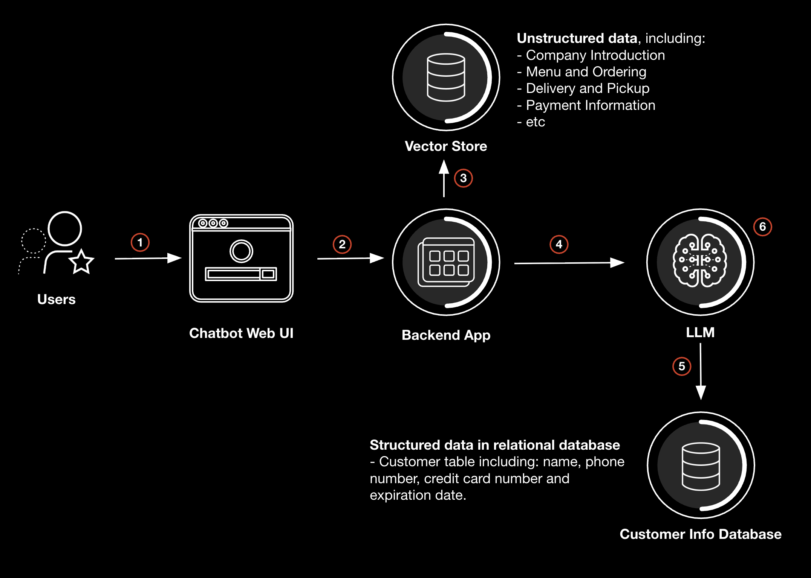

# Vito's Pizza Cafe - AI Customer Service Application

A comprehensive demonstration of a pizza cafe customer service application built with LangGraph and RAG (Retrieval-Augmented Generation). This project showcases various AI security vulnerabilities and their mitigation using Palo Alto Networks AI Runtime Security (AIRS) API.

## Overview

This application demonstrates common attack vectors in Gen AI applications, particularly in RAG-based systems, and how to protect against them using Palo Alto Networks AI Runtime Security API. It serves as a practical example of implementing AI security best practices in a real-world scenario.

### Key Attack Vectors Demonstrated:

1. Prompt Injection - Goal Hijacking
2. Prompt Injection - System Prompt Leak
3. Sensitive Information Disclosure - PII Leak
4. Data Poisoning - Malicious URL in Output
5. Data Poisoning - Toxic Content in Output
6. Excessive Agency - Database Data Tampering

## Prerequisites

- Python 3.12 or higher
- pip package manager
- API Keys:
  - Cohere API Key: Required for text embedding and document reranking
  - Deepseek API Key: Required for generating responses and executing tool-based actions
  - Palo Alto Networks AI Runtime Security (AIRS) API Key
- Palo Alto Networks AI Runtime Security (AIRS) API Profiles for both input and output inspection

## Application Architecture

### System Overview
    


### Message Processing Flow

1. User submits a query through the Chatbot Web UI
2. The Chatbot Web UI securely forwards the query to the application
3. Relevant documents are retrieved from the vector store based on the query
4. The application sends the query and contextual data to the LLM
5. The LLM queries the external database for customer information
6. A response is generated using both vector store and database information
7. The response is sent to the user

### Core Components

The application consists of the following components:
- RAG system for information retrieval
    - Chunking based on markdown tags
    - FAISS vector store
    - Similarity search and reranking based on Cohere models
- LangGraph React agent-based conversation flow
- SQLite Database
- Database integration using LangChain bind tools

## Installation Guide

1. Clone the repository:
```bash
git clone https://github.com/leonhanl/vitos-pizza-cafe
cd vitos-pizza-cafe
```

2. Create and activate a virtual environment:
```bash
python -m venv .venv
# On Windows:
.venv\Scripts\activate
# On Unix or MacOS:
source .venv/bin/activate
```

3. Install dependencies:
```bash
pip install -e .
```

4. Configure environment variables:
```bash
cp .env.example .env
# Edit .env with your API keys and configuration
# Cohere API Key is required for both embedding and reranking
```

## Running the Application

1. Run the backend:
   ```bash
   uvicorn backend.api:app --reload --host 0.0.0.0 --port 8000
   ```

   To verify the backend API:
   ```bash
   python tests/test_api_integration.py
   ```

2. Launch the web interface:
   ```bash
   python -m http.server 5500
   ```

   Open a web browser and navigate to: http://localhost:5500

3. Try some common questions:
   ``` 
   What's on the menu?
   ```
   ```
   Do you deliver?
   ```
   


## Contributing

Contributions are welcome through the standard GitHub fork and pull request workflow.

## License

This project is licensed under the MIT License - see the [LICENSE](LICENSE) file for details.

## Support

For support, please open an issue in the GitHub repository or contact the maintainers.


