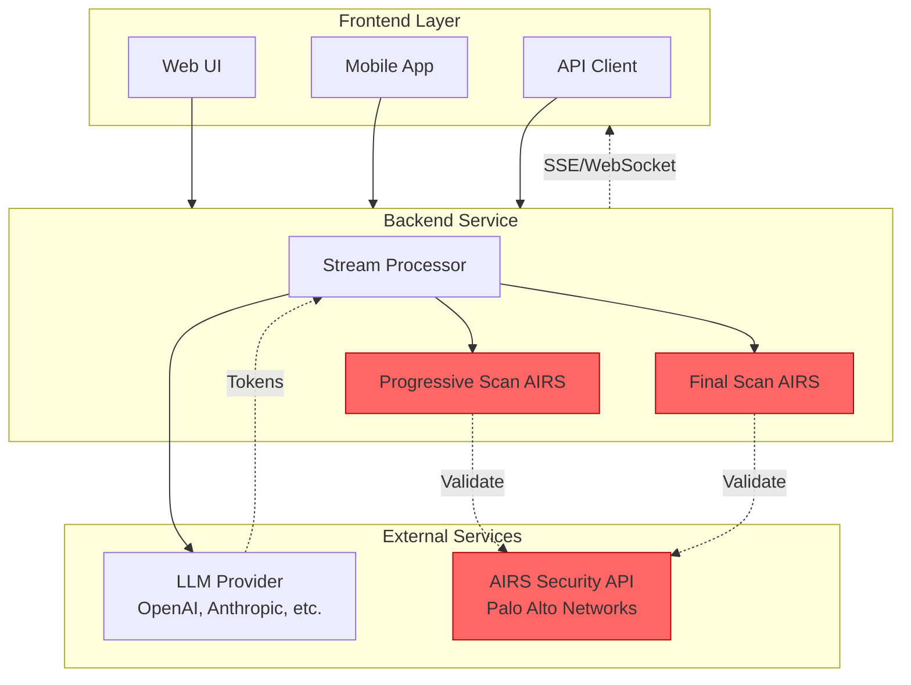
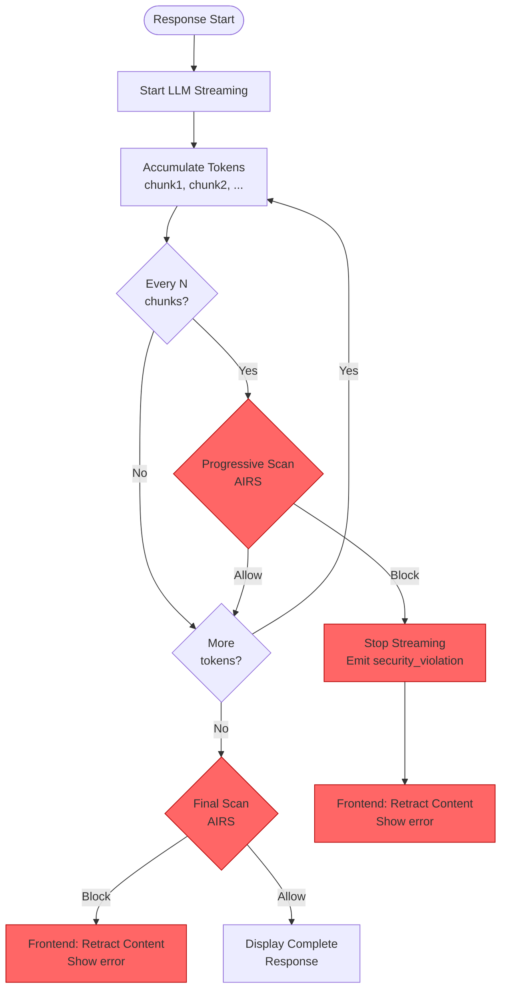
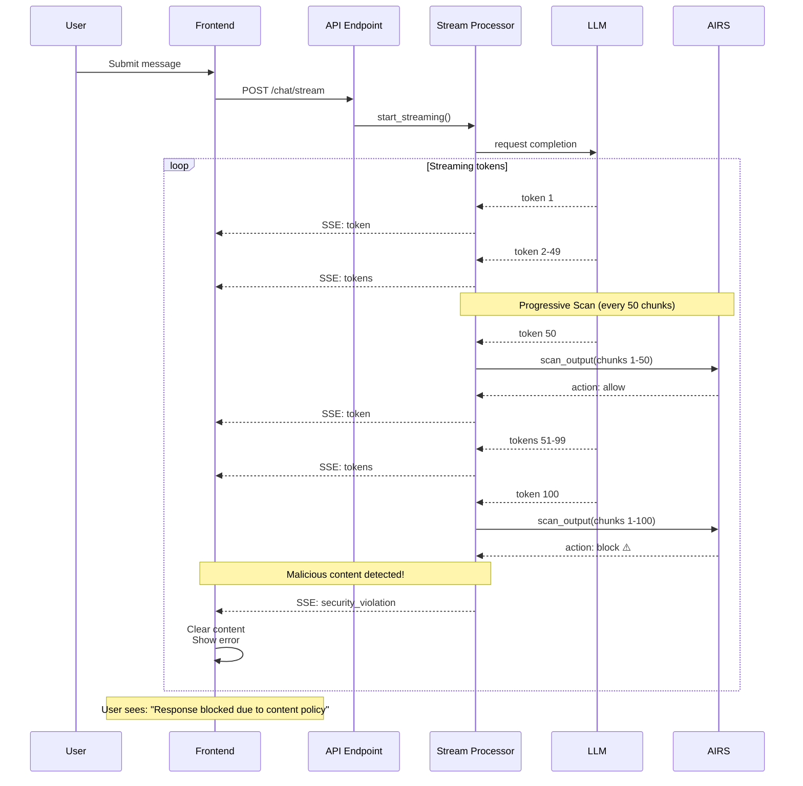
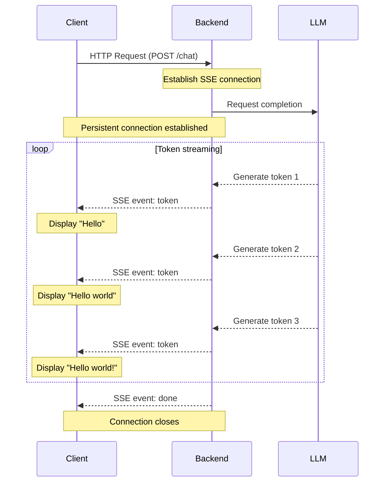

# Implementing AIRS Protection for Streaming AI Applications

**Date**: 2025-11-28
**Version**: 1.0
**Target**: Generic streaming agentic AI applications with frontend/backend architecture

---

## 1. Executive Summary

### Problem Statement

Modern Agentic AI applications display LLM responses token-by-token to provide a better user experience, rather than waiting for the complete generation before showing any output. The former approach is commonly called "streaming mode", while the latter is referred to as "non-streaming mode" or "blocking mode". *[See Appendix A for SSE protocol overview if unfamiliar with streaming architectures.]*

Output security presents significant risks and is a critical concern in the AI security domain.

**Output Security Risks**: Agentic AI systems face critical risks in their output, including:
- **Sensitive data leakage** (PII disclosure, confidential information)
- **Inappropriate content generation** (toxic content, discriminatory language, hate speech)
- **Malicious content injection** (phishing URLs, harmful instructions)

**Non-Streaming vs Streaming Protection**:

In **non-streaming (blocking)** mode, security validation is straightforward:
- Wait for the LLM to generate the complete response
- Scan the entire output once
- If malicious content is detected, return an error to the client
- The user never sees the problematic content

In **streaming mode**, the challenge is significantly more complex, requiring a balance of three competing requirements:
  1. **Preserve user experience**: Maintain streaming output without disrupting UX
  2. **Minimize exposure**: Detect and retract problematic content as quickly as possible
  3. **Reasonable cost and complexity**: Practical implementation without excessive API calls or complexity

### Solution Overview

This document presents a **progressive output scanning** approach for streaming AI applications:

**Progressive Output Scanning** - Validate LLM responses *during* streaming at regular intervals (e.g., every 50 chunks), with immediate content retraction at the frontend upon threat detection.

### Key Benefits
- **Mid-stream threat detection**: Catch PII disclosure, toxic content, and malicious URLs during streaming
- **Immediate content retraction**: Stop streaming and clear displayed content the moment malicious output is detected
- **Cost-effective**: Configurable scan frequency allows optimization for security requirements vs API costs


---

## 2. Architecture & Design

### 2.1 Component Architecture

The following diagram shows all logical components and their security integration points:




### 2.2 Progressive Output Scanning

**When**: Every N chunks during LLM streaming (e.g., every 50 chunks)
**Where**: Stream processing layer
**Blocking**: Stop streaming + emit `security_violation` event + retract displayed content
**Coverage**: LLM-generated text output only (not tool calls/results)

### 2.3 Security Data Flow

The following diagram shows the flow of data through security checkpoints:



**Normal Flow (Benign Content)**:
```
User Request → Stream tokens → Progressive scans (allow) → Final scan (allow) → Display
```

**Blocked Flow (Malicious Content Detected)**:
```
User Request → Stream tokens → Progressive scan (block) → Stop stream → Retract content → User sees error
OR
User Request → Stream tokens → Progressive scans (allow) → Final scan (block) → Retract content → User sees error
```

---

## 3. Implementation Patterns

### 3.1 Backend: Progressive Output Scanning Pattern

**File**: Stream Processing / Chat Service (e.g., `chat_service.py`)

```python
async def process_stream_with_airs(
    llm_stream: AsyncIterator,
    scan_interval: int = 50
) -> AsyncIterator[dict]:
    """Process LLM stream with progressive AIRS scanning."""

    accumulated_response = ""
    chunk_count = 0

    # Stream tokens from LLM
    async for chunk in llm_stream:
        content = extract_text_content(chunk)
        if not content:
            continue

        accumulated_response += content
        chunk_count += 1

        # Yield token to frontend immediately
        yield {"type": "token", "content": content}

        # Layer 2: Progressive scan every N chunks
        if chunk_count % scan_interval == 0 and config.AIRS_ENABLED:
            try:
                scan_result = await airs_scanner.scan_output(
                    response=accumulated_response,
                    profile=config.OUTPUT_PROFILE_NAME
                )

                if scan_result.action == "block":
                    # Log violation with context
                    log_security_violation(
                        scan_type="output",
                        scan_context="progressive",
                        chunks_accumulated=chunk_count,
                        ...
                    )

                    # Signal frontend to retract content
                    yield {
                        "type": "security_violation",
                        "message": "Response blocked due to content policy"
                    }

                    # Stop streaming immediately
                    return

            except Exception as e:
                # Fail-open: log error and continue streaming
                logger.error(f"AIRS progressive scan failed: {e}")

    # Final scan after streaming completes
    if config.AIRS_ENABLED and accumulated_response:
        try:
            final_result = await airs_scanner.scan_output(
                response=accumulated_response,
                profile=config.OUTPUT_PROFILE_NAME
            )

            if final_result.action == "block":
                log_security_violation(scan_context="final", ...)
                yield {
                    "type": "security_violation",
                    "message": "Response blocked due to content policy"
                }
                return
        except Exception as e:
            logger.error(f"AIRS final scan failed: {e}")

    # Stream completed successfully
    yield {"type": "done"}
```

**Key Points**:
- **Progressive scanning**: Scan accumulated content every N chunks (not just final output)
- **Immediate retraction**: Emit `security_violation` event and stop streaming on detection
- **Final scan**: Always scan complete message to catch threats in last chunks
- **Fail-open**: Continue streaming if AIRS API fails (with error logging)
- **Conversation history**: Record user input only when blocking (for audit trail)

### 3.2 Frontend: Content Retraction Pattern

**File**: Frontend JavaScript (e.g., `script.js`)

```javascript
async function streamChatWithSecurity(message) {
    const response = await fetch('/api/v1/chat/stream', {
        method: 'POST',
        headers: {'Content-Type': 'application/json'},
        body: JSON.stringify({message})
    });

    if (!response.ok) {
        const error = await response.json();
        displayError(error.detail);
        return;
    }

    const reader = response.body.getReader();
    const decoder = new TextDecoder();
    let accumulatedContent = "";

    while (true) {
        const {done, value} = await reader.read();
        if (done) break;

        const chunk = decoder.decode(value);
        const events = parseSSE(chunk);  // Parse SSE format

        for (const event of events) {
            switch (event.type) {
                case 'token':
                    // Accumulate and display progressively
                    accumulatedContent += event.content;
                    updateDisplay(accumulatedContent);
                    break;

                case 'security_violation':
                    // IMMEDIATE RETRACTION
                    accumulatedContent = "";
                    displaySecurityError(
                        "Response blocked. The response couldn't be displayed " +
                        "due to our content policy. Please try rephrasing."
                    );
                    return;  // Stop processing

                case 'done':
                    console.log('Streaming complete');
                    break;
            }
        }
    }
}
```

**Key Points**:
- **Immediate retraction**: Clear `accumulatedContent` and display error on `security_violation` event
- **Stop processing**: Return from function immediately after retraction - no further events processed
- **Visual feedback**: User sees error message in place of the retracted content

---

## 4. Key Design Decisions

### Scan Interval Configuration
- **Default (Balanced)**: Every **50 chunks** - Good balance of security coverage and AIRS API cost
- **High-Security**: Every **20 chunks** - Faster threat detection, higher API cost
- **Cost-Optimized**: Every **100 chunks** - Lower API cost, longer exposure window (0-100 chunks)

**Configuration**:
```bash
AIRS_STREAM_SCAN_INTERVAL=50  # Scan every N content chunks
```

**Trade-off**: Shorter intervals = faster detection + higher cost. Longer intervals = lower cost + longer exposure.

### Fail Mode: Fail-Open
**Decision**: Prioritize availability over blocking when AIRS API fails.

**Rationale**:
- AIRS API failures (network errors, timeouts) should not break user experience
- Security logs capture all scan failures for monitoring
- Production systems prioritize uptime - fail-closed can be enabled for high-security scenarios

**Implementation**: Wrap all AIRS scan calls in `try/except` and continue streaming on exception.

### Timing: Synchronous Scanning
**Decision**: Use synchronous (blocking) scans instead of asynchronous.

**Rationale**:
- **Simplicity**: Easier to implement and reason about
- **Acceptable latency**: AIRS API typically responds in super short time - not noticeable to users
- **Correctness**: No race conditions between streaming and scanning
- **Future optimization**: Can move to async if profiling shows UX issues

### Coverage: LLM Output Only
**Decision**: Scan only LLM-generated text output, not tool calls or tool results.

**Rationale**:
- **Primary threat**: LLM output is the main attack surface (prompt injection, PII disclosure)
- **Performance**: Scanning all tool results significantly increases AIRS API calls
- **Future extension**: Tool scanning can be added later if threat model requires it

### Final Scan: Always Scan
**Decision**: Always perform final scan of complete message, even if recently scanned.

**Rationale**:
- **Simplicity**: No complex logic for "recently scanned" thresholds
- **Guarantees**: Ensures complete content is validated before persisting to conversation history
- **Edge cases**: Catches malicious content in last chunks (e.g., chunks 91-100 when interval is 50)

---

## 5. Sequence Diagram

The following sequence diagram shows the timing of progressive scans during streaming:



**Timeline**:
1. User submits message
2. LLM streaming begins, tokens flow to frontend
3. At chunk 50, progressive scan #1 completes successfully (brief pause for AIRS API call)
4. Streaming continues, more tokens displayed
5. At chunk 100, progressive scan #2 detects malicious content
6. Stream stops immediately, frontend retracts all content and shows error

**User Experience**:
- Tokens 1-100 were briefly visible (~2-3 seconds depending on LLM speed)
- Content immediately retracted when threat detected
- User sees sanitized error message

---

## 6. Reference Implementation

This design is based on a production implementation available in the **Vito's Pizza Cafe** codebase.

For Complete Implementation Details, see the full codebase at: [Vito's Pizza Cafe Repository](https://github.com/yourusername/vitos-pizza-cafe)

The complete implementation includes:
- Comprehensive error handling and logging
- Conversation history management
- Stateful vs stateless streaming modes
- Unit and integration test suites
- Deployment scripts and monitoring

---

## Summary

This design provides a **progressive output scanning** approach for streaming AI applications that detects and retracts malicious content mid-stream.

**Key characteristics**:
- **Progressive scanning**: Validates LLM output every N chunks (e.g., 50) during streaming
- **Immediate content retraction**: Stops streaming and clears displayed content upon threat detection
- **Final scan**: Always validates complete message to catch threats in remaining chunks
- **Fail-open behavior**: Prioritizes availability - continues streaming if AIRS API fails
- **Configurable intervals**: Balance security coverage vs API costs (20/50/100 chunks)
- **Framework-agnostic**: Applicable to any backend/frontend streaming architecture
- **User-friendly errors**: Never exposes security details to end users


For detailed implementation guidance, reference the Vito's Pizza Cafe codebase.

---

## Appendix A: Server-Sent Events (SSE) Protocol Overview

For readers unfamiliar with streaming architectures, this section provides a brief introduction to Server-Sent Events (SSE), the protocol commonly used for streaming AI responses.

### What is SSE?

**Server-Sent Events (SSE)** is a standard HTTP-based protocol that enables servers to push data to clients over a single, long-lived connection. Unlike traditional request-response patterns where the client receives one complete response, SSE allows the server to send multiple messages (events) over time through the same connection.

In AI applications, SSE is ideal for streaming LLM responses token-by-token as they're generated, rather than waiting for the complete response before displaying anything to the user.

### Traditional vs Streaming Communication

| Aspect | Traditional (Blocking) | Streaming (SSE) |
|--------|------------------------|-----------------|
| **Connection** | Single request-response | Persistent connection |
| **Data arrival** | All at once | Progressive chunks |
| **User sees content** | After complete generation | During generation |
| **Time to first byte** | 5-30 seconds (entire response) | <1 second (first token) |
| **User experience** | Loading spinner, then full text | Text appears progressively |

### SSE Data Flow

The following diagram shows how data flows in a streaming architecture:



### SSE Message Format

SSE messages follow a simple text-based format. Each event consists of one or more fields:

```
event: token
data: {"type": "token", "content": "Hello"}

event: token
data: {"type": "token", "content": " world"}

event: token
data: {"type": "token", "content": "!"}

event: done
data: {"type": "done"}
```

**Key characteristics**:
- Each event starts with `event:` (optional) and `data:` (required)
- Events are separated by blank lines (`\n\n`)
- Client processes each event immediately as it arrives
- Connection stays open until server sends final event and closes

### Why SSE Matters for Security

The streaming nature of SSE creates unique security challenges:

1. **Partial content visibility**: Users may see 50-100 tokens before a security scan completes
2. **Progressive exposure**: Malicious content (PII, toxic language, phishing URLs) may appear mid-stream
3. **Content retraction requirement**: If threats are detected mid-stream, already-displayed content must be retracted

This is why the **progressive output scanning** approach described in this document is necessary - traditional "scan once at the end" strategies don't work when users can already see partial content.

---
